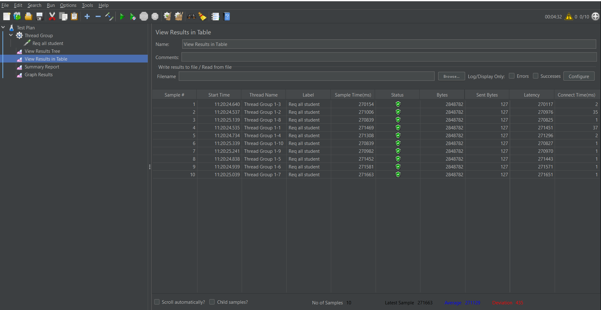
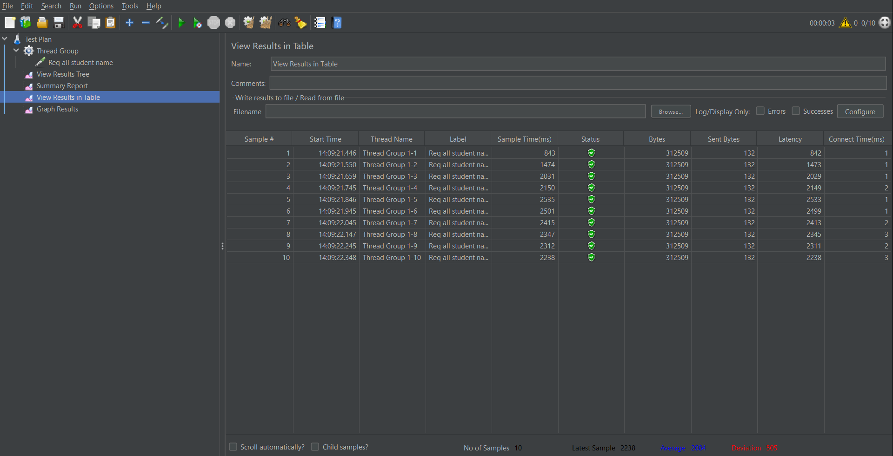
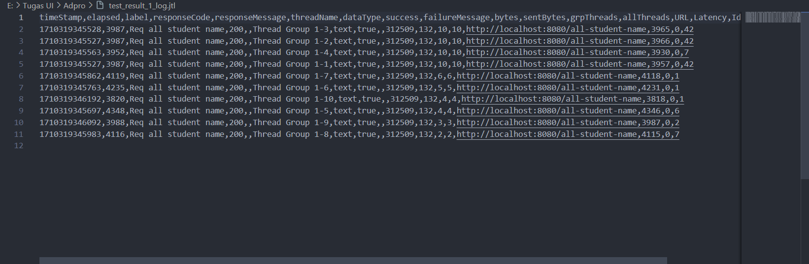
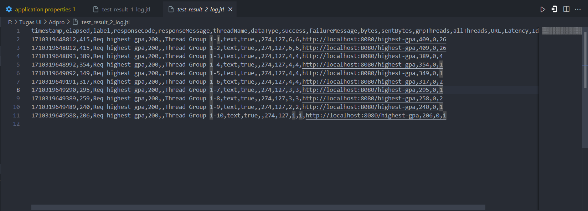
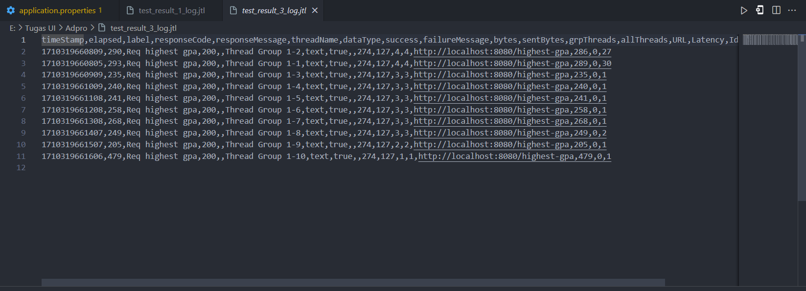
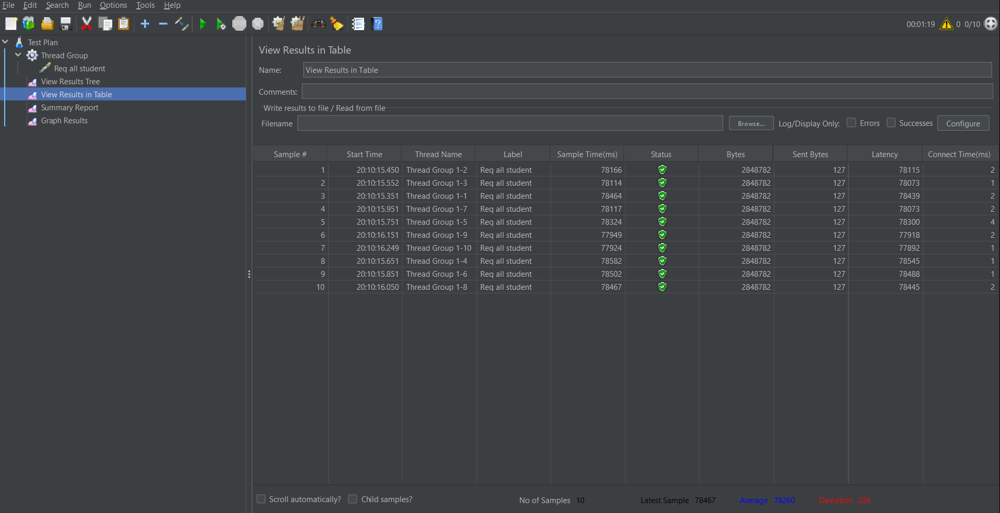
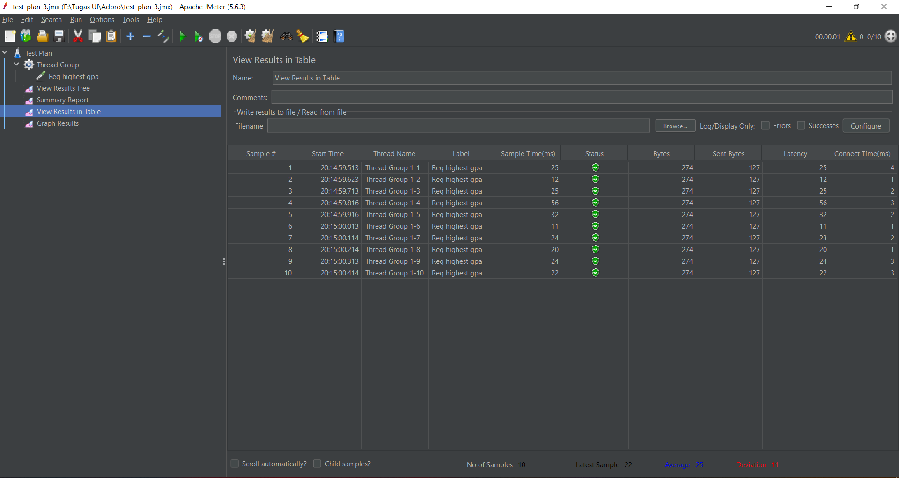

# Reflection

## 1. Hasil Screenshot

### Hasil JMeter sebelum refactor / profiling
- GUI

- CLI

### Hasil JMeter setelah refactor / profiling

## 2. QnA
1. JMeter hanya memeriksa waktu yang dihabiskan untuk memroses request tanpa memeriksa setiap bagian yang terjadi pada proses tersebut. Sedangkan Intellij Profiler memberikan kita *report* jelas terkait fungsi apa saja yang mengambil waktu lama, fungsi apa saja yang dijalankan ketika memroses, dll.
2. Proses profiling dapat memberikan *report* yang jelas terkait fungsi-fungsi yang dieksekusi, dari *report* tersebut kita bisa menemukan bagian mana yang mengambil waktu paling lama
3. Menurut saya sebenarnya bisa, tetapi saya masih perlu belajar cara menganalisa *report* yang dihasilkan oleh Profiler
4. Paling susah adalah membaca / menganalisa *report* yang dihasilkan oleh Profiler, cara saya mengatasi hal tersebut adalah dengan mencari sumber-sumber online terkait bagaimana cara menggunakan profiler dengan benar.
5. Dengan Intellij Profiler saya dapat dengan mudah menemukan titik penghambat yang ada pada codebase.
6. Saya akan membandingkan kedua hasil tersebut dan menganalisa secara seksama untuk mengetahui hasil mana yang lebih akurat / sesuai
7. Saya akan mencari bagian mana yang menjadi titik penghambat, kemudian saya akan memikirkan solusi yang lebih optimal dari sebelumnya. Untuk memastikan fungsionalitas nya tidak terganggu, maka akan dilakukan testing untuk mencegah adanya bug / error.
